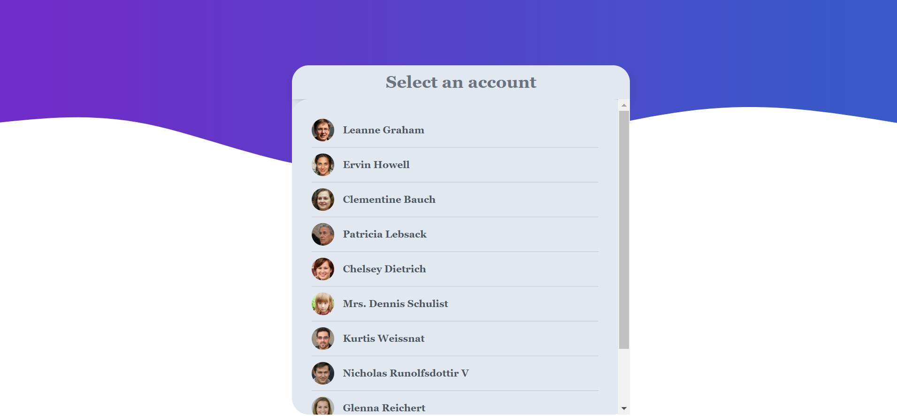
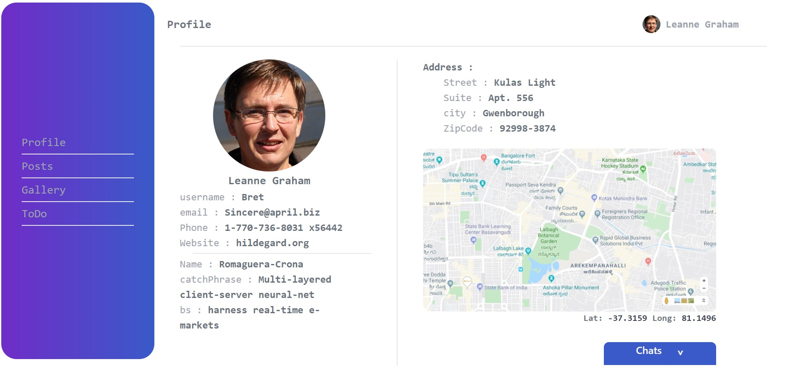
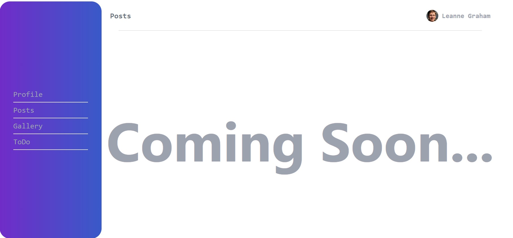
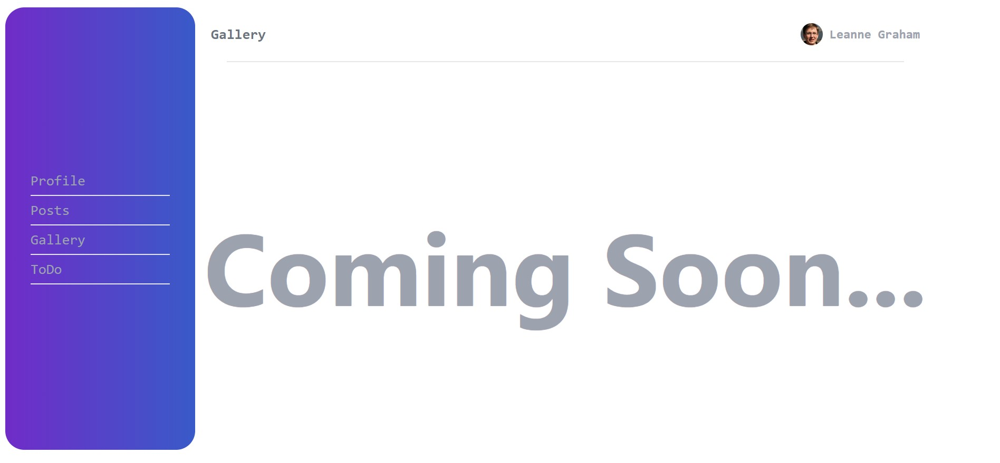
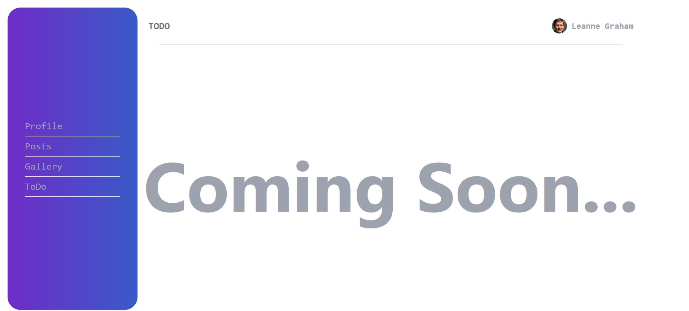
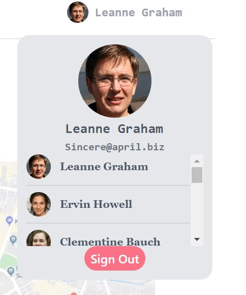
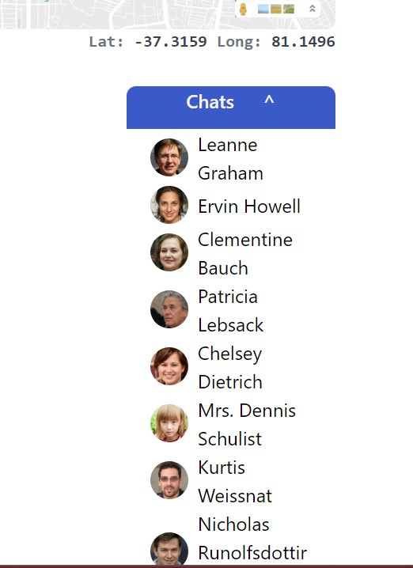

## Project made as part of Panorbit assigment

[LiveLink](https://assignment-panorbit.netlify.app/)
[GitHub](https://github.com/amaanraaz/userdetails_panorbit)

## How to Run:
- Download the zip from GitHub.
- Now extract the file in local and open the folder in any code editor
- Now run npm install , this will install all the dependencies automaticall
- Now to run the project after all installations run the commant npm start

## Snapshot from live:
Home Page

Profile Page

Post Page

Gallery Page

To DO Page

Profile Menu

Chat
